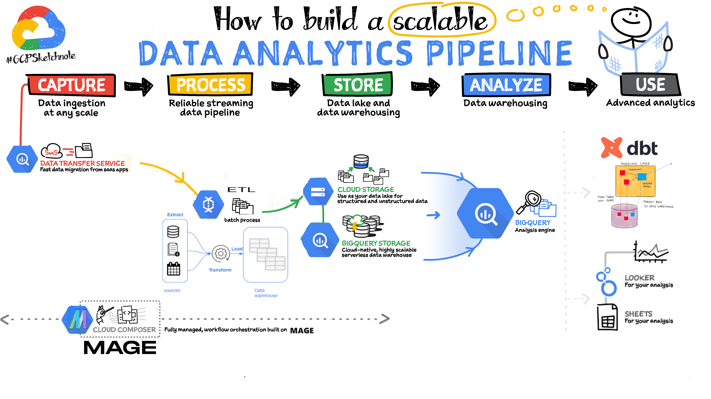
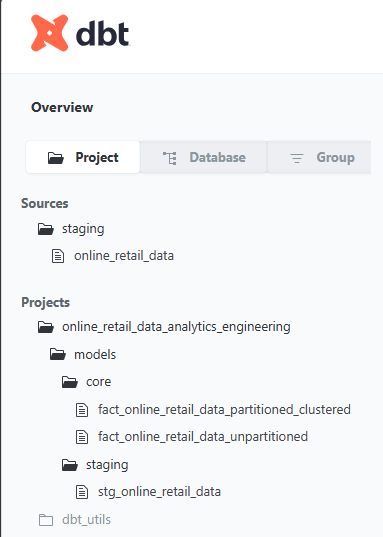

# End_to_end_data_pipeline---Optimizing_Online_Retail_Analytics_with_Data_and_Analytics_Engineering



## **PROBLEM STATEMENT**

In the realm of online retail, understanding customer behavior, identifying sales trends, and optimizing inventory management are critical for success. HoIver, extracting actionable insights from vast amounts of transactional data poses significant challenges. This project aims to address these challenges by developing an end-to-end data pipeline and analytics engineering solution.

-  Design and implement a robust data pipeline to ingest, process, and analyze online retail transaction data.
- Utilize analytics engineering techniques to transform raw data into actionable insights, ensuring data quality, consistency, and relevance.
-  Build intuitive dashboards to visualize key performance indicators (KPIs), trends, and patterns, enabling stakeholders to make informed decisions.
-  Automate infrastructure provisioning, data processing, and dashboard deployment using Infrastructure as Code (IaC) and Continuous Integration/Continuous Deployment (CI/CD) practices.


# **TECHNOLOGIES USED**

- **Cloud Platform**: Google Cloud Platform (GCP)

- **Infrastructure as Code (IaC)**: Terraform

- **Workflow Orchestration**: Mage

- **Data Warehouse**: BigQuery

- **Data Modeling and Transformation**: dbt (Data Build Tool)

- **Dashboarding**: Looker Studio


## **DATASET**:
The project utilizes the "Online Retail" dataset from the UCI Machine Learning Repository. This dataset contains transactional data from an online retail store based in the United Kingdom, covering transactions betIen 01/12/2010 and 09/12/2011.

#### Files and Directories
```
├── data
│   ├── Online Retail.xlsx
│   └── README.md
```

Here are some details about the "Online Retail" dataset:

- **Source**: UCI Machine Learning Repository
- **Description**: This dataset contains transactional data from an online retail store based in the United Kingdom. The data includes customer information, product details, invoice numbers, transaction dates, and sales quantities. It covers transactions that occurred betIen 01/12/2010 and 09/12/2011.
- **Features**: The dataset includes attributes such as InvoiceNo, StockCode, Description, Quantity, InvoiceDate, UnitPrice, CustomerID, and Country.
- **Format**: The dataset is typically provided in a CSV (Comma Separated Values) format.
- **Size**: The dataset is relatively small, with around 500,000 records.

You can find the "Online Retail" dataset on the UCI Machine Learning Repository Ibsite. Here is the direct link: [Online Retail Dataset](https://archive.ics.uci.edu/ml/datasets/online+retail).


# **INFRASTRUCTURE AS CODE (IaC)**:

#### Terraform
[Terraform](https://www.terraform.io/) is an open-source infrastructure as code software tool created by HashiCorp. It allows users to define and provision data center infrastructure using a high-level configuration language known as HashiCorp Configuration Language (HCL).

#### Files and Directories
```
├── mage-ai-Terraform-Infrastructure-As-Code
│   ├── README.md
│   ├── db.tf
│   ├── fs.tf
│   ├── load_balancer.tf
│   ├── main.tf
│   └── variables.tf
```

#### Usage
1. **Installation**: Ensure Terraform is installed on your local machine.
2. **Configuration**: Modify the `variables.tf` files to match desired infrastructure configuration.
3. **Initialization**: Run `terraform init` to initialize the working directory containing Terraform configuration files.
4. **Planning**: Run `terraform plan` to create an execution plan. This step is optional but recommended to verify changes before applying them.
5. **Execution**: Run `terraform apply` to apply the changes required to reach the desired state of the configuration.
6. **Verification**: After applying changes, verify that the infrastructure has been provisioned correctly.
7. **Cleanup**: When done, run `terraform destroy` to destroy all the resources defined in the Terraform configuration.


## **WORKFLOW ORCHESTRATION WITH MAGE**
   - Implemented workflow orchestration using  Mage to Develop batch processing and managing pipeline execution.

### **PIPELINE DESIGN**

I created two main pipelines to handle the processing of my dataset:

1. **loading_from_api_transformations_to_gcs_partitioned**:
   - This pipeline focuses on extracting data from an API source, applying necessary transformations and cleaning processes, and then exporting the processed data to Google Cloud Storage (GCS) in a partitioned format.

2. **loading_from_google_cloud_storage_to_bigquery_table**:
   - This pipeline is responsible for loading data from Google Cloud Storage into BigQuery tables. It includes components for data loading from GCS, transformation steps (if required), and exporting the data to BigQuery tables.


### **Components and Directories**

#### 1. **loading_from_api_transformations_to_gcs_partitioned** Pipeline:


- **Pipelines Directory**:
```
└── mage-ai-Workflow-Orchestration
    ├── magic-zoomcamp
        ├── pipelines
        │   └── loading_from_api_transformations_to_gcs_partitioned
        ├── data_loaders
        │   └── load_data_from_api.py
        ├── transformers
        |   └── transform_and_clean_api_data.py
        └── data_exporters
            └── export_data_to_google_cloud_stoage_partitioned.py
```

- **Pipeline Components**:
  - **Data Loaders**:
    - `load_data_from_api.py`: Module responsible for extracting data from the API source.
  - **Transformers**:
    - `transform_and_clean_api_data.py`: Module for applying transformations and cleaning processes to the extracted data.
  - **Data Exporters**:
    - `export_data_to_google_cloud_stoage_partitioned.py`: Exporter module to export the processed data to Google Cloud Storage in a partitioned format.


#### 2. **loading_from_google_cloud_storage_to_bigquery_table** Pipeline:


- **Pipelines Directory**:
```
└── mage-ai-Workflow-Orchestration
    ├── magic-zoomcamp
        ├── pipelines
        │   └── loading_from_google_cloud_storage_to_bigquery_table
        ├── data_loaders
        │   └── load_data_from_google_cloud_storage.py
        └─ data_exporters
            └── export_data_to_google_bigquery.py
```

- **Pipeline Components**:
  - **Data Loaders**:
    - `load_data_from_google_cloud_storage.py`: Module responsible for loading data from Google Cloud Storage.
  - **Data Exporters**:
    - `export_data_to_google_bigquery.py`: Exporter module to export the processed data to BigQuery tables.

### Orchestration Triggers


I configured triggers or schedules within Mage to orchestrate the execution of my pipeline components at predefined intervals. By setting up daily triggers, I ensured that my pipelines run periodically, keeping my data processing up-to-date and synchronized with the latest changes.


## **DATA TRANSFORMATIONS WITH DBT**

In this section, I leverage dedicated data transformation tool DBT (Data Build Tool) to prepare my data for analytics. dbt enables us to apply transformations, ensure data quality, and maintain consistency through validation and cleansing processes. Let's delve into the details:



#### Files and Directories
```
├── dbt-Analytics_Engineering(Data Build Tool)
│   ├── dbt_project.yml
│   ├── models
│   |   ├── core
│   |   │   ├── fact_online_retail_data_partitioned_clustered.sql
│   |   │   └── fact_online_retail_data_unpartitioned.sql
│   |   └── staging
│   |       ├── schema.yml
│   |       └── stg_online_retail_data.sql
│   └── tests
```

### Transformation Process


I've organized my transformations into dbt models within the project structure. These models serve the purpose of converting raw data from staging tables into structured formats suitable for analytics and reporting. Let's dive into the details of my transformation process:

1. **Staging Tables**:

   

   - To kick off the transformation journey, I load raw data into staging tables (`stg_online_retail_data`) sourced from various data origins. These staging tables act as holding grounds for the unprocessed data retrieved from external systems.

2. **Core Models**:

   - Within the `core` directory, I've crafted dbt models that take charge of refining staged data into structured, analytics-ready formats. These models typically represent fact and dimension tables, shaping the foundation for insightful analysis and reporting.

   - Includes:
     - `fact_online_retail_data_partitioned_clustered.sql`
       

     - `fact_online_retail_data_unpartitioned.sql`
       

3. **Partitioning and Clustering**:

   - To optimize query performance and streamline data accessibility, I've tactically partitioned and clustered my tables. Notably, the fact tables are partitioned by `invoice_datetime` and clustered by `customer_id`, aligning with the typical access patterns of my analytics queries.

4. **Testing**:

   - Ensuring data quality and consistency is paramount. Hence, I've implemented rigorous testing mechanisms. The `schema.yml` file houses definitions for tests designed to validate the structure and integrity of my transformed data.

### Deployment Job


To ensure the continuous availability of up-to-date analytics-ready data, I've configured a dbt deployment job to run every 12 hours. This automated process seamlessly deploys my transformed data to BigQuery, facilitating a consistent and reliable analytics environment.


# (CI/CD)-CONTINOUS-INTERGRATION-AND-DEPLOYMENT


#### Files and Directories
```
├── (CI.CD)-Continous-Intergration-and-Deployment
│   └── cloudbuild.yaml
```

#### `cloudbuild.yaml`
This file serves as the blueprint for orchestrating the CI/CD process using Google Cloud Build.

During the CI phase, the defined workflow in `cloudbuild.yaml` triggers whenever changes are pushed to the repository. This triggers an automated build process, ensuring that the latest changes are integrated and tested seamlessly.

Following successful CI, the CD pipeline takes over. It automatically deploys the updated artifacts, ensuring the continuous delivery of the data pipeline to the production environment. This automated deployment process eliminates manual interventions, reducing the risk of errors and accelerating the time-to-market for new features and enhancements.


# **BUILD THE DASHBOARD**:
   - Choose a BI tool such as Data Studio for creating the dashboard.
   - Design intuitive visualizations that provide insights into the processed data.

* Building a dashboard to visualize the data


#### Files and Directories

```
├── Looker_studio_Dashboard
```

- 1 graph that shows the distribution of some categorical data
- 1 graph that shows the distribution of the data across a temporal line


- **Source**: [UCI Machine Learning Repository - Online Retail Dataset](https://archive.ics.uci.edu/ml/datasets/online+retail)

- **Description**: Transactional data including customer information, product details, invoice numbers, transaction dates, and sales quantities.

- **Format**: Typically provided in CSV format.

- **Size**: Approximately 500,000 records.

## Infrastructure as Code (IaC)

Infrastructure provisioning is automated using Terraform, ensuring consistency and scalability.

- **Main Configuration Files**: `main.tf`, `db.tf`, `fs.tf`, `load_balancer.tf`, `variables.tf`

- **Usage**: Terraform CLI commands for initialization, planning, execution, and cleanup.

## Data Pipeline Design

The data pipeline comprises several components:

1. **Batch Data Ingestion**: Data is ingested from sources like Google Cloud Storage and APIs.

2. **Workflow Orchestration**: Mage orchestrates batch processing and pipeline execution.

3. **Data Transformation**: dbt is used for data transformation to prepare it for analytics.

4. **Data Loading**: Transformed data is loaded into BigQuery for analytics and dashboarding.

5. **Dashboard Visualization**: Looker Studio creates intuitive visualizations for data analysis.

## Analytics Engineering with dbt

- **Models**: `fact_online_retail_data_partitioned_clustered.sql`, `fact_online_retail_data_unpartitioned.sql`

- **Transformation**: Cleaning, validation, and transformation of raw data.

- **Documentation**: Lineage graphs and model overviews ensure clarity and reproducibility.

## Dashboard Development

Looker Studio creates intuitive dashboards to visualize key performance indicators and trends.

- **Visualization Types**: Distribution charts, temporal line graphs.

- **Dashboard Components**: Categorical data distribution, temporal data distribution.

## Continuous Integration/Continuous Deployment (CI/CD)

CI/CD practices are implemented using Cloud Build for automated deployment.

- **CI/CD Configuration**: `cloudbuild.yaml`

- **Automated Deployment**: Infrastructure provisioning, data processing, and dashboard deployment.

## Conclusion

By leveraging cloud services, IaC, workflow orchestration, and visualization tools, this project optimizes online retail analytics. It enables businesses to derive actionable insights from raw transactional data, facilitating informed decision-making, strategic planning, and enhanced customer experiences. The end-to-end data pipeline and analytics engineering solution demonstrate the poIr of modern data technologies in driving business growth and innovation.
